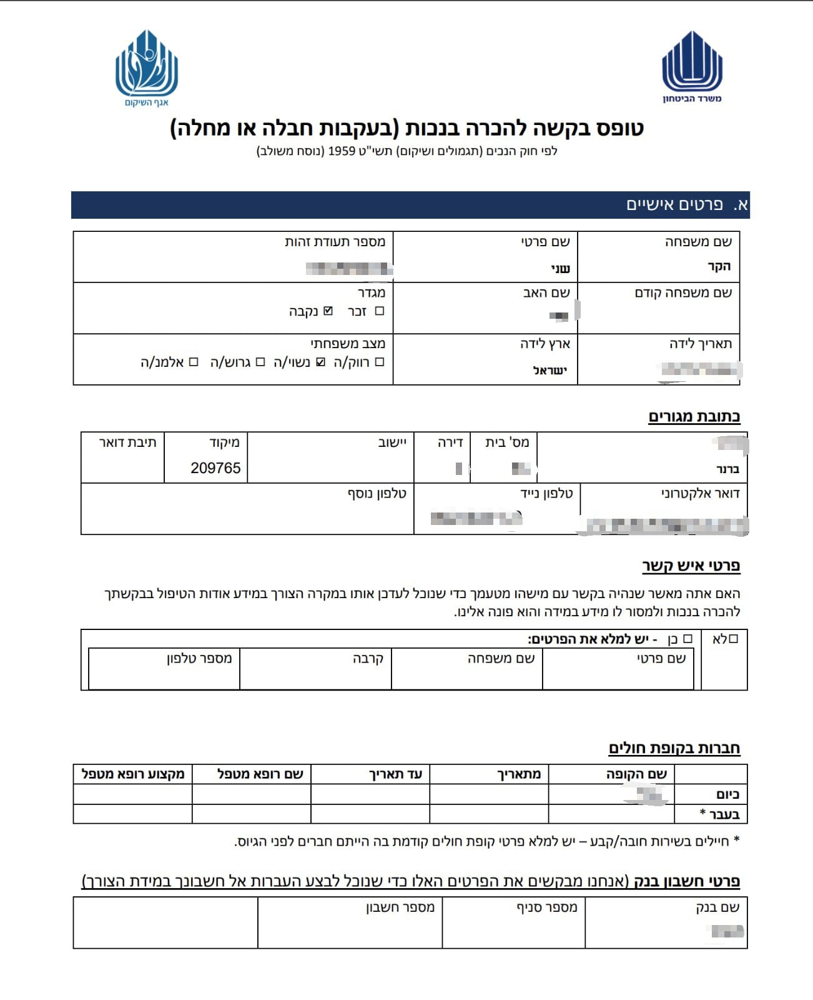
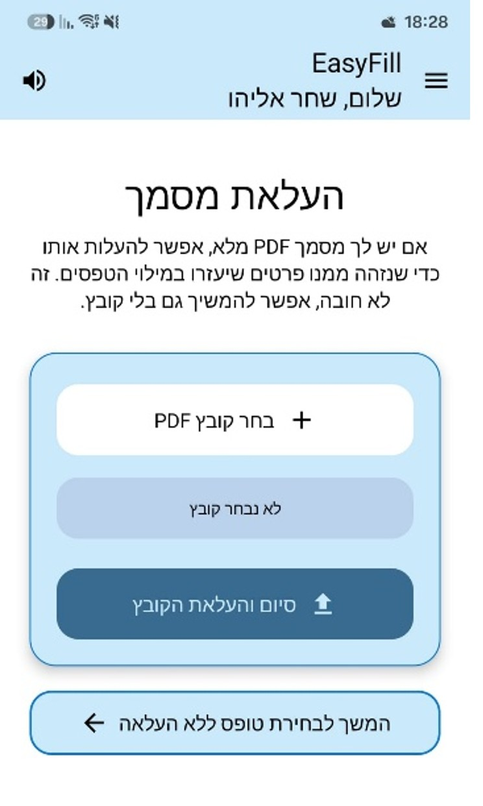
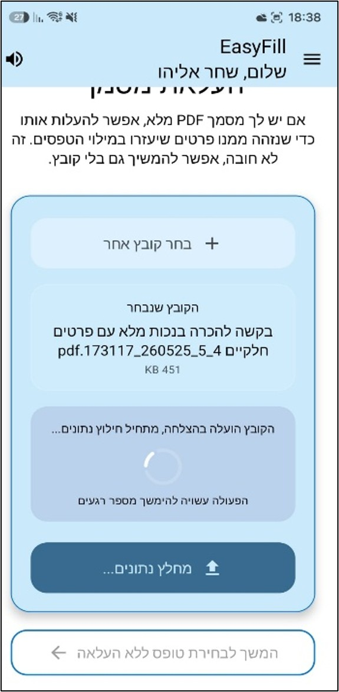
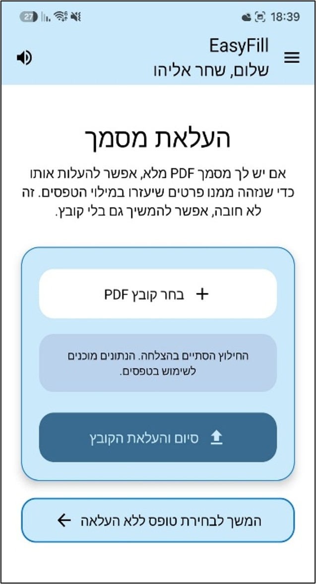

# EasyFill

  
  
  
  

EasyFill is an accessible Android application that assists individuals coping with post-traumatic stress disorder (PTSD) in completing complex bureaucratic forms. The system combines AI-powered document processing, automatic form completion, multimodal distress detection, personalized accessibility adaptations, and a real-time digital assistant to reduce cognitive load throughout the form-filling process.

---

## Related Repository

The evaluation and testing of the multimodal distress-detection algorithms are maintained in a dedicated repository separate from the Android application.

**EasyFill – Distress Detection Evaluation Repository**

https://github.com/Shahar132/EasyFill-Testing

---

<em>Figure 1. EasyFill main application screen.</em>

---

# Features

## Intelligent Document Processing

EasyFill enables users to upload previously completed PDF documents and automatically extracts structured information for reuse in future forms. The uploaded document is securely processed using Azure AI Document Intelligence through a Google Cloud Run middleware, after which the extracted information is prepared for automatic form completion.

---

### Step 1 – Selecting a Document

  

<em>Figure 2. Selecting a previously completed PDF document for processing.</em>

The user selects a previously completed PDF document from the device. After validating the selected file, the application prepares it for secure upload and processing.

---

### Step 2 – Uploading the Document

  

<em>Figure 3. The selected document has been uploaded and is ready for extraction.</em>

Once the document is uploaded, it is securely transmitted through the Google Cloud Run middleware to Azure AI Document Intelligence for document analysis.

---

### Step 3 – Processing the Document

  

<em>Figure 4. The document is being analyzed by Azure AI Document Intelligence.</em>

Azure AI Document Intelligence extracts Hebrew text, identifies tables, key-value pairs, selection marks, and document structure. The extracted information is normalized and converted into structured suggestions for later reuse.

---

### Step 4 – Extraction Completed Successfully

  

<em>Figure 5. Successful completion of the document extraction process.</em>

After extraction is completed, the structured information is securely stored in Firebase and becomes available for automatic completion of future forms.

---

## Testing

The multimodal distress-detection evaluation is maintained in a dedicated repository separate from the Android application.

### EasyFill – Distress Detection Evaluation Repository

Repository:

https://github.com/Shahar132/EasyFill-Testing

The testing repository contains the complete evaluation environment used during the development of EasyFill's distress-detection component, including:

- Jupyter Notebook used to execute the complete evaluation pipeline.
- Python implementation of the distress-detection evaluation.
- CSV datasets collected during the experimental evaluation.
- Feature processing and scoring logic.
- Performance evaluation of the multimodal distress-detection algorithm.
- Analysis used to validate the distress scoring approach.

### Running the Evaluation

1. Clone the testing repository.
2. Open the project using **Jupyter Notebook** or **JupyterLab**.
3. Install the required Python dependencies.
4. Open the provided notebook (`.ipynb`).
5. Execute the notebook cells sequentially from top to bottom.

The notebook automatically loads the included CSV datasets, performs the preprocessing and evaluation steps, and reproduces the distress-detection analysis used during the development of EasyFill.

> **Note:** GitHub renders Jupyter Notebook (`.ipynb`) files directly in the browser, allowing the notebook to be viewed without additional tools. To execute the notebook, inspect outputs interactively, or reproduce the experimental evaluation, it should be opened locally using **Jupyter Notebook** or **JupyterLab**. Opening the notebook in environments such as Android Studio may display the notebook as its underlying JSON file rather than as an interactive notebook.
